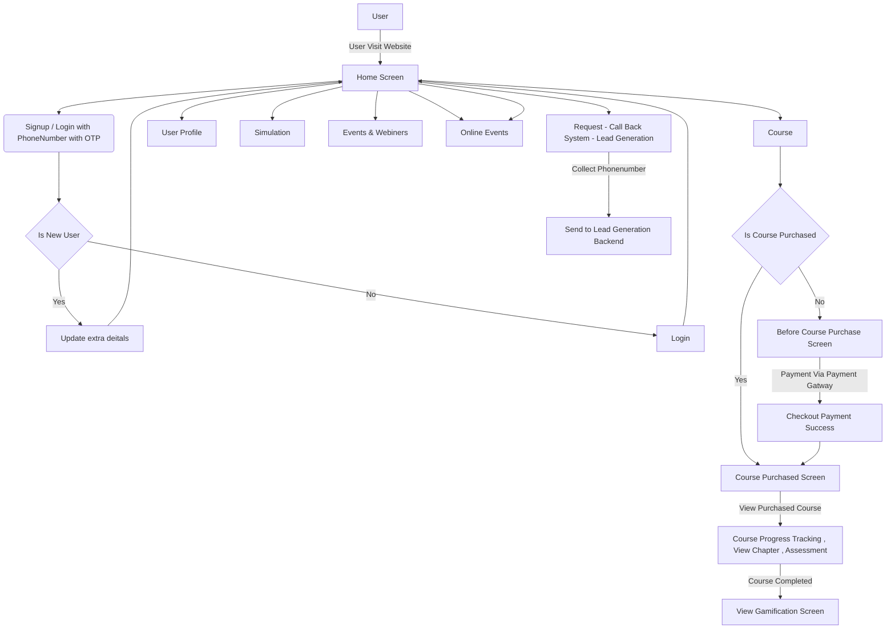

# Exper - Content Delivery - Flutter Web/Mobile

> Version 1.0

Exper - Content Delivery platform is a whitelabeled e-learning website along with the course along with gamification, online events , simulation , contact program , events & webinars, Dynamic contents for the website has been obtained from the Exper CMS API.


# Development Environment

 - Flutter - Dart Language.

 -  Flutterflow - Dart Language, UI Development & Basic Functionality.

   - Analytics - Yet to be decided

## Dependency used In this project

- Shared Preferences (Persistent Memory) - [https://pub.dev/packages/shared_preferences](https://pub.dev/packages/shared_preferences)

- Get the International Phone Number Code - [https://pub.dev/packages/intl_phone_field](https://pub.dev/packages/intl_phone_field)


- OTP Verification Autofill - [https://pub.dev/packages/pinput](https://pub.dev/packages/pinput)
- RazorPay - [https://pub.dev/packages/razorpay_flutter_customui](https://pub.dev/packages/razorpay_flutter_custom)
- Stripe - [https://pub.dev/packages/flutter_stripe](https://pub.dev/packages/flutter_stripe)

## Overall Flow Diagram

Web overall flow diagram:


Mobile overall flow diagram:

```mermaid
graph TD
    A[User] -->|User Opens Mobile App| B
    B(Signup / Login with PhoneNumber with OTP) --> C{Is New User}
    C -->|Yes| D[Update extra deitals] -->F[Home Screen]
    C -->|No| E[Login] --> F[Home Screen]
    F --> H[Course] --> I{Is Course Purchased} -->|Yes| J[Course Purchased Screen] -->|View Purchased Course| V[Course Progress Tracking , View Chapter , Assessment] -->|Course Completed| X[View Gamification Screen]
    I -->|No| K[Before Course Purchase Screen] -->|Payment Via Payment Gatway| L[Checkout Payment Success] -->J
    F --> G[User Profile]
    F --> AA[Simulation]
    F --> BB[Events & Webiners]
    F --> CC[Contact Program]
    F --> CC[Online Events]
    F --> DD[ Request - Call Back System - Lead Generation] -->|Collect Phonenumber| FF[Send to Lead Generation Backend]
    G --> JJ[Menu]
    JJ --> KK[Saved Items]
    JJ --> TT[My Learning]
    JJ --> KK[My Activity]
    JJ --> YY[Refer & Earn]
    JJ --> 66[Settings]
    JJ --> 77[Logout]
